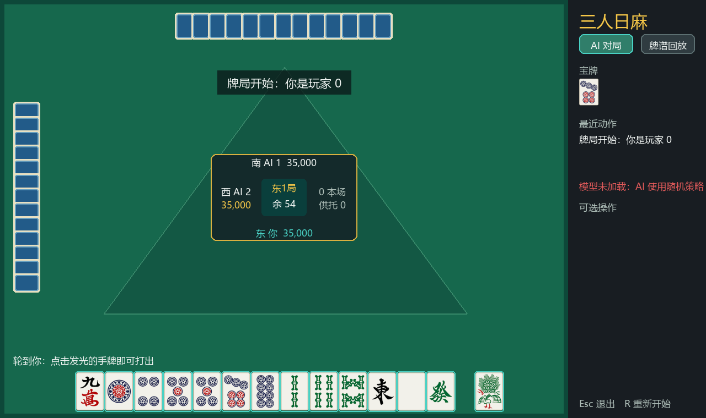

# MahjongTrioAI

三人日本麻将（Sanma）研究项目，包含麻将环境、Pygame 对战 GUI、监督学习与 PPO 训练代码，以及 Mahjong Copilot 的本地模型适配。

这个仓库公开**源代码和经过清理的对战汇总结果**。模型权重、训练数据、训练日志、真实牌谱、爬取代码、账号配置和浏览器会话均不随仓库发布。GUI 可以在没有模型的情况下运行，两个 AI 此时使用随机合法动作；训练与 Copilot 推理需要自行准备相应的本地数据或权重。

## 功能

- 三人日麻单局环境与完整东南风场，提供合法动作掩码、奖励和公开牌桌状态。
- `6 × 30` 基础观测、`101 × 30` 公开信息观测和 `121 × 30` 场况观测，统一使用 177 个动作。
- 一名玩家对战两名 AI 的 Pygame GUI，支持赤五、立直、碰杠、拔北及本地牌谱回放。
- CNN、残差卷积、Tile Transformer 和卷积注意力模型；按整份牌谱划分数据的监督训练，以及 PPO 微调。
- 座位轮换、相同牌山、镜像阵容与置信区间对战评测。
- Mahjong Copilot 的 MJAI 事件转换、本地模型加载和建议界面。

## 项目结构

```text
MahjongTrioAI/
├── mahjong_env/                  三人麻将环境、特征与计分
├── gui/                          Pygame 牌桌、控制器与回放器
├── assets/tiles/                  GUI 使用的单张牌面图片
├── training/                     数据加载、并行采样与 PPO 支持
│   └── rules_candidate_*.py       独立的候选规则实现
├── integrations/MahjongCopilot/   上游 Copilot 与 MahjongTrioAI 适配
├── tests/                        规则、训练及协议适配回归测试
├── battle_results/               脱敏后的 JSON/CSV 汇总
├── docs/                         环境、训练与发布说明
├── scripts/check_public_release.py  发布文件检查
├── main.py                       GUI 入口
├── model.py                      网络结构与 checkpoint 加载
├── train_all.py / train_rich.py / train_match.py
├── ppo_train.py / ppo_train_rules.py / ppo_train_consistent_rules.py
├── battle_models.py / battle_models_rules.py / compare_copilot_model.py
└── PUBLIC_MANIFEST.json           发布文件清单及 SHA-256
```

上饶麻将及其他本地研究项目未纳入本次三人日麻发布。



## 快速开始

以 Python 3.11 为运行示例，在仓库根目录执行：

```powershell
python -m venv .venv
.\.venv\Scripts\Activate.ps1
python -m pip install -r requirements.txt
python main.py
```

Linux/macOS 的虚拟环境激活命令为 `source .venv/bin/activate`。GUI 需要桌面显示环境。

已有兼容权重时，使用：

```powershell
python main.py --model model/model.pt
```

权重仅放在本地，`model/` 已在 `.gitignore` 中排除。程序通过 checkpoint 的元数据选择对应观测；加载失败时界面显示错误，并使用随机合法动作 AI。

操作：点击手牌出牌；在右侧选择和牌、立直、碰、杠、拔北或跳过；选择立直、暗杠或加杠后点击对应牌。`Esc` 取消选择或退出，结束后按 `R` 重新开始。

回放器读取用户自行提供的雀魂 JSON 文件：

```powershell
python main.py --replay-dir replays
```

在界面点击“牌谱回放”，用方向键切换步骤与小局，用 `1`、`2`、`3` 切换玩家视角。仓库不提供牌谱和获取牌谱的程序。

## 环境 API

```python
import numpy as np
from mahjong_env.game import ThreePlayerMahjong

env = ThreePlayerMahjong()
observations = env.reset(current_player=0)
done = False
while not done:
    actions = {
        player: int(np.random.choice(np.flatnonzero(obs["action_mask"])))
        for player, obs in observations.items()
    }
    observations, rewards, done = env.step(actions)
```

每次只提交当前返回的玩家观测对应的动作。完整场次使用 `mahjong_env.match.SouthMatch`；动作编码、观测与规则边界见 [环境说明](docs/ENVIRONMENT.md)。

## 训练

```powershell
python -m pip install -r requirements-training.txt
```

从自备数据训练基础网络：

```powershell
python train_all.py --data data/data.pkl --models tile_transformer --epochs 30
```

从自备牌谱生成 101 层特征，并从随机初始化训练：

```powershell
python train_rich.py --replay-dir replays --from-scratch --epochs 20
```

PPO 从已有兼容 checkpoint 热启动：

```powershell
python ppo_train.py --base-model training_runs/rich_tile_transformer/best.pt --game-mode hand --updates 100 --output-dir ppo_runs/local_trial
```

`train_match.py` 训练 121 层场况策略；完整南风场 PPO 需配套场况 checkpoint。数据格式、候选规则训练和输出目录见 [训练说明](docs/TRAINING.md)。训练脚本会在本地生成权重和日志，这些目录已排除。

## Mahjong Copilot

```powershell
python setup_mahjong_copilot.py
.\.venv-copilot\Scripts\python.exe run_mahjong_copilot.py
```

安装脚本创建独立虚拟环境并安装 Playwright Chromium。Linux/macOS 使用 `./.venv-copilot/bin/python run_mahjong_copilot.py`。

将自备兼容 checkpoint 放入本地 `model/model.pt`，在 Copilot 设置中选择 `MahjongTrioAI`。也可以复制 `integrations/MahjongCopilot/settings.example.json` 为同目录的 `settings.json` 再修改路径。实际配置、证书、浏览器数据和日志不会被 Git 收录。

MahjongTrioAI 模式仅支持三人麻将，无需 Mortal 的本地扩展。公开包不含 Mortal 权重、`libriichi` / `libriichi3p` 二进制或 Windows 代理注入程序；使用 `Local` Mortal 模式和 `compare_copilot_model.py` 需自行补齐对应依赖。来源、改动和运行边界见 [Copilot 说明](integrations/MahjongCopilot/README.md)。

## 对战结果

公开结果见 [对战结果索引](battle_results/README.md)。仅保留每个模型及每项配对比较的牌山组数均不少于 1000 的实验。每个实验保留原始汇总中的完成标志、样本数、点差、胜率、顺位和置信区间；原始模型路径、逐局过程、进度快照和错误消息已移除。

| 代表实验 | 模式 | 结果概要 |
|---|---|---|
| `ppo_vs_baseline` | 独立小局 | PPO 每局平均净点约 +154.52，baseline 约 −161.04 |
| `feature_ab` | 独立小局 | rich 约 +428.39，legacy 约 −442.77 |
| `south_8h_checkpoint_league` | 完整南风场 | 6 小时 checkpoint 平均顺位约 1.9837，平均净点约 +599.26 |
| `south_8h_vs_copilot/t3_6.0h` | 完整南风场 | 我方平均顺位约 1.9829，Copilot-Mortal 约 2.0171 |

不同实验的模式、阵容和样本数不同，不能直接横向排名。`completed: false` 是中间统计；低于 1000 组的小样本与 smoke 结果未公开。Copilot 对战存在桥接后备动作与环境规则差异，结果只描述当时模拟器条件下的表现。权重未公开，因此读者可以检查方法和汇总，但无法仅凭本仓库逐项复现历史模型成绩。

用自备模型进行新评测：

```powershell
python battle_models.py --models A=model/a.pt B=model/b.pt --game-mode south --max-steps 3000 --output-dir artifacts/local_battle
```

新评测请写入 `artifacts/`，不要将含模型路径或逐局记录的原始报告直接放入公开结果目录。

## 检查与发布

```powershell
python -m pytest -q
python scripts/check_public_release.py
```

发布范围、文件清单与上传步骤见 [发布检查说明](docs/PUBLISHING.md)。当前目录不包含原项目 Git 历史；审阅完成后从这个目录建立新仓库。

## 来源与许可

Mahjong Copilot 源码来自 [latorc/MahjongCopilot](https://github.com/latorc/MahjongCopilot)，其随附许可证和版权声明保留在 [上游 LICENSE](integrations/MahjongCopilot/LICENSE)。其他组件的来源及许可状态见 [THIRD_PARTY_NOTICES.md](THIRD_PARTY_NOTICES.md)。本次整理未替项目原创代码新增许可证。
